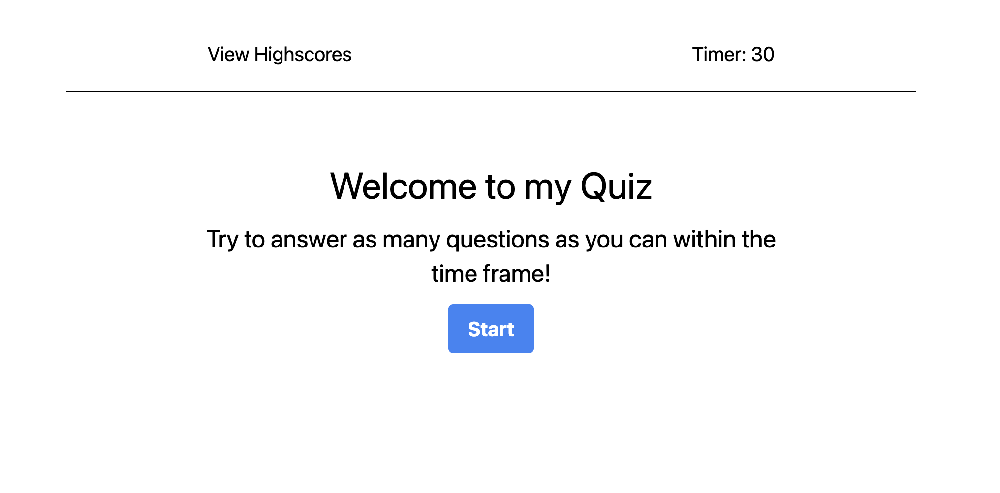
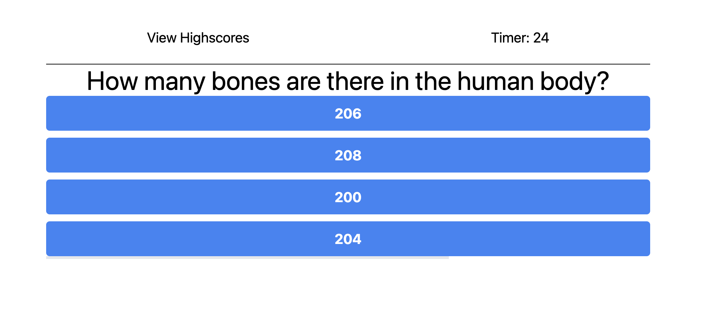
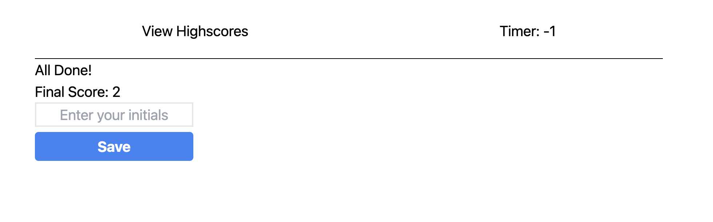
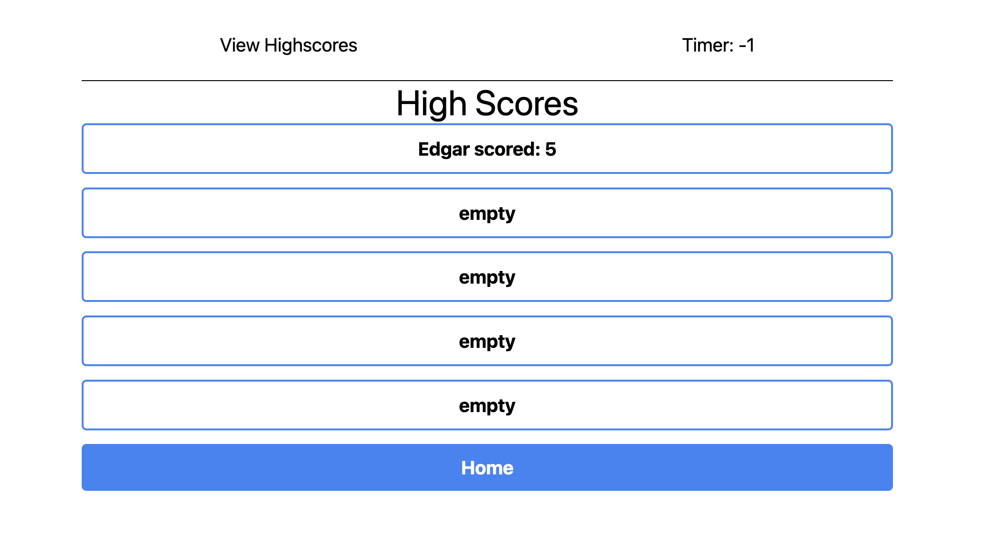

# 04 Web APIs: Code Quiz

## User Story

```
AS A user
I WANT to take a timed quiz on random trivia and store my high scores
SO THAT I can gauge my random trivia compared to my peers
```

## Acceptance Criteria

```
GIVEN I am taking a quiz
WHEN I click the start button
THEN a timer starts and I am presented with a question
WHEN I answer a question
THEN I am presented with another question
WHEN I answer a question incorrectly
THEN 3 seconds is subtracted from the timer
WHEN all questions are answered or the timer reaches 0
THEN the game is over
WHEN the game is over
THEN I can save my initials and my score
WHEN I click on View Highscores (top left)
THEN I am shown a list of high scores
```

## Mock-Up

Start page:


Quiz Started:


Quiz Ends - Enter Initials:


View High Scores:

